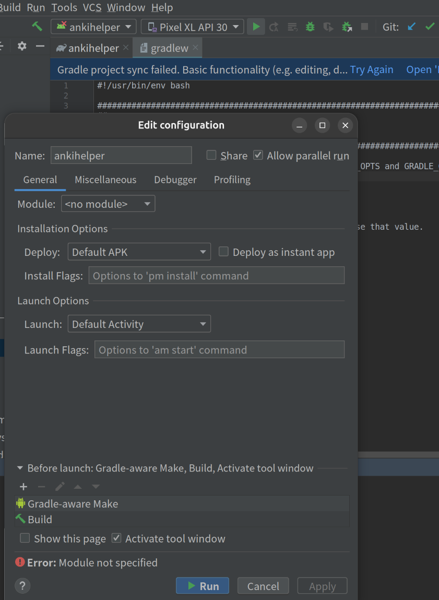
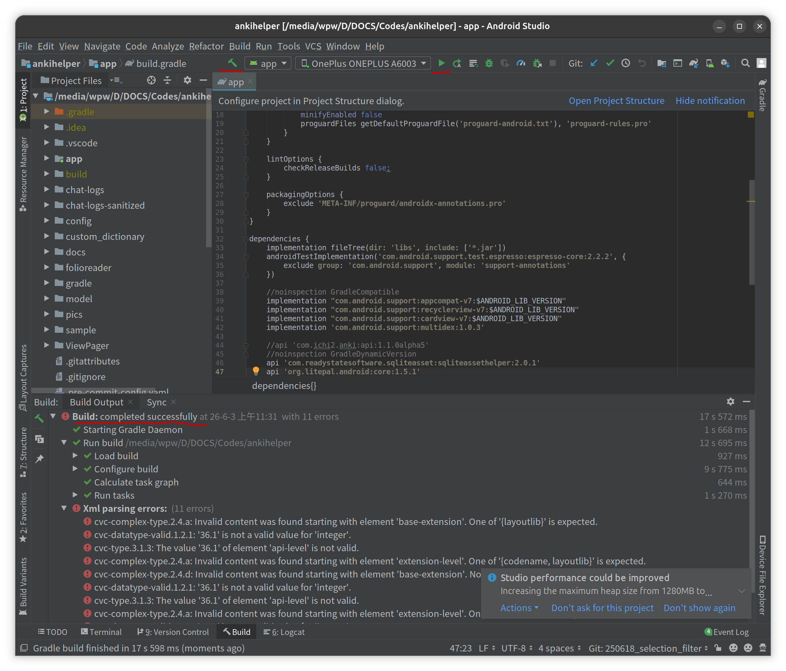

# 项目情况
当前项目ankihelper是一个19年停止维护的开源的android项目

# 个人运行项目的踩坑过程：

## 1.安装最新版Andrioi Studio去打开运行当前项目

## 问题1：最新版Android Studio报gradle安装失败错误：

`ERROR: Could not install Gradle distribution from 'https://services.gradle.org/distributions/gradle-5.1.1-all.zip'.`
我的最新版Android Studio【Android Studio Panda 4 | 2025.3.4 Patch 1】，打开我的老项目之后，就直接报这个错误。

### 解决办法：把gradle-5.1.1-all.zip手动放入缓存目录

把下载好的 zip 文件直接放到 Gradle 的缓存目录：
- 1.腾讯云的连接上下载过gradle-5.1.1-all.zip
- 2.找到目录：C:\Users\你的用户名\.gradle\wrapper\dists\gradle-5.1.1-all\
- 3.里面会有一个随机字符串的子文件夹（如 9bb8ke4k5xxxxx）
- 4.把 gradle-5.1.1-all.zip 放进去
- 5.重新打开 Android Studio

### 效果：使用`./gradlew assembleDebug`等gradlew命令可以成功编译出apk

## 问题2：新版 Android Studio 与老项目 AGP 版本不兼容

ubuntu上最新的AS打开19年的安卓项目，点击run图标，AS命令终端里报错：
```bash
Gradle sync issues

The project is using an incompatible version (AGP 3.4.2) of the Android Gradle plugin. Minimum supported version is AGP 7.1.0.
See Android Studio & AGP compatibility options.
```

### 解决办法：安装旧版 Android Studio（适合只想看看老代码、不想改项目）

如果你只是想临时编译运行一下这个老项目，最省事的办法是安装一个兼容 AGP 3.4.2 的旧版 Android Studio：

| AGP 版本 | 兼容的 Android Studio 版本 |
|----------|--------------------------|
| 3.4.x | Android Studio 3.4 ~ 3.5 |
| 3.5.x | Android Studio 3.5 ~ 3.6 |

**下载旧版 AS 的方法：**

- 打开 Android Studio 下载文件归档 https://developer.android.com/studio/archive?hl=zh-cn
- 下载 Android Studio 3.5 版本

### 效果：用老版本AS打开项目，不再报AGP版本问题

## 问题3：上述gradle、AS以及运行app用的安卓手机或虚拟机等各种运行环境准备好之后，AS上运行构建app的图形按钮不可用

我的gradle弄好了。VAD也下载运行成功。现在发现AS里没有运行app的按钮。配置的话，也报错：
```
Error: Module not specified
```



### 问题分析：

题很明确：**Android Studio 无法识别项目模块（Module）**，导致运行配置报错 Error: Module not specified，同时顶部工具栏缺少运行按钮。

### 解决步骤：

- 第一步：强制重新同步项目
    - 点击顶部菜单 File → Invalidate Caches / Restart...
    - 选择 Invalidate and Restart（清除缓存并重启 AS）
- 第二步：修复模块识别
    - 1.在 Android Studio 中：
        - File → Project Structure → Project Settings → Project
            - Project SDK 选择 Android API Level（如 Android API 34 Platform）
        - Project Settings → Modules
            - 检查左侧列表是否有 app 模块
            - 如果没有 → 点击 + → Import Module → 选择 app 目录
    - 2.关键操作：
        - 在 Project 视图（不是 Android 视图）中：
            - 右键点击 app 文件夹 → Mark as → Module Root
            - 重新同步 Gradle（点击顶部 Sync Project with Gradle Files 按钮）
- 第三步：重建运行配置
    - 1.Run → Edit Configurations...
    - 2.点击 + → Android App
    - 3.配置如下：
        - Name: app
        - Module: 选择 app（下拉菜单中必须出现）
        - Launch Options → Launch: Default Activity
    - 4.点击 Apply → OK
### 效果：AS打开项目后，点击build、run等图标能够正确构建运行

AS可以正常编译运行时的状态如图：